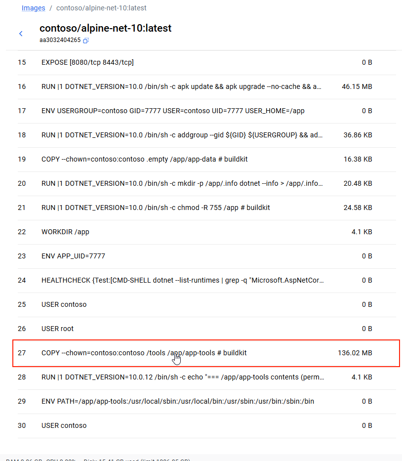
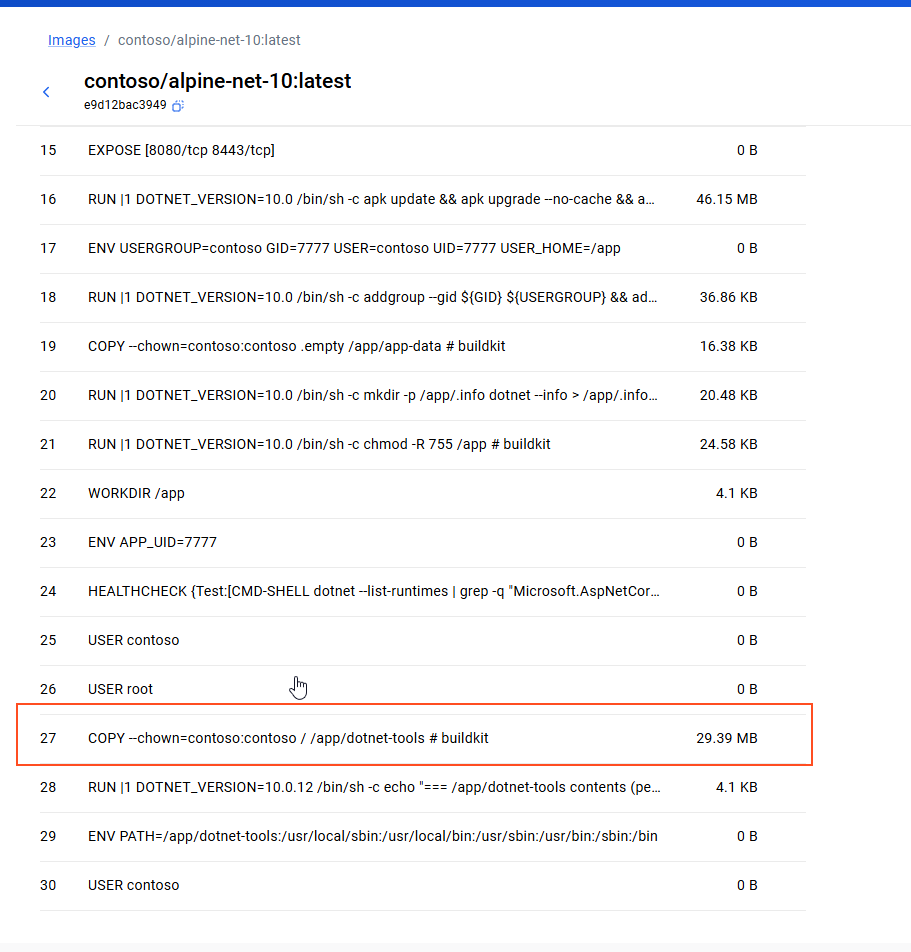
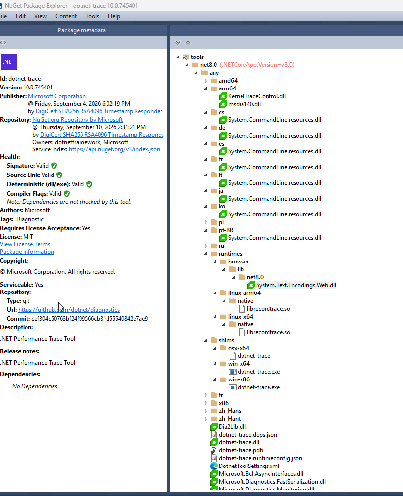

# Diagnostic tools build

`DotNet-Tools.ps1` builds one shared folder for `dotnet-counters`, `dotnet-debug`, `dotnet-gcdump`, and `dotnet-trace`. Image builds copy that folder and put it on `PATH`. That replaces four separate `dotnet tool install` trees inside the diagnostics image.

## Why the script exists

Alpine and Ubuntu images can be built with in-container diagnostics:

```bash
docker build -f dockerfiles/alpine/10/Dockerfile \
  --target final \
  --build-context dotnet-tools=dockerfiles/.dotnet-tools \
  -t contoso/alpine-net-dotnet-tools-10:latest \
  dockerfiles/alpine/10
```

Installing each CLI inside the image would look like this, then copy the whole tree into the runtime stage:

```dockerfile
FROM mcr.microsoft.com/dotnet/sdk:${DOTNET_VERSION}-alpine AS tools-env

RUN mkdir -p /tools && \
    dotnet tool install dotnet-counters --tool-path /tools && \
    dotnet tool install dotnet-debug --tool-path /tools && \
    dotnet tool install dotnet-gcdump --tool-path /tools && \
    dotnet tool install dotnet-trace --tool-path /tools

FROM aspnet-base AS final
USER root
COPY --chown=contoso:contoso --from=tools-env /tools /app/dotnet-tools
ENV PATH="/app/dotnet-tools:${PATH}"
USER contoso
```

That `COPY` for `dotnet-debug`, `dotnet-gcdump`, and `dotnet-trace` adds about **136 MB** to the image. Docker Desktop shows it as its own layer:



`dotnet tool install` keeps each NuGet package intact under its own directory. The four packages repeat the same framework assemblies, and each package also ships files a Linux x64 container never loads.

`DotNet-Tools.ps1` builds one merged folder and the image copies that instead of the separate install trees. The measured three-tool `COPY` in Docker Desktop is **29.39 MB** (~30 MB):



## What each package actually contains

A package such as `dotnet-trace` is not a single executable. Under `tools/net8.0/any` it carries its own copy of the managed libraries, plus every culture, symbol file, and runtime identifier the NuGet package was built with:



The same shape shows up in all four packages:

| Left in the package | Examples |
| --- | --- |
| A private copy of shared framework libraries | `System.CommandLine.dll`, `System.Text.Json.dll`, `Microsoft.Diagnostics.NETCore.Client.dll`, `Microsoft.Extensions.*` |
| Culture satellites | `cs`, `de`, `es`, `fr`, `it`, `ja`, `ko`, `pl`, `pt-BR`, `ru`, `tr`, `zh-Hans`, `zh-Hant` |
| Symbols and docs | `*.pdb`, `*.xml` |
| Native builds for other operating systems and CPUs | `win-*`, `osx-*`, `linux-arm`, `linux-arm64`, `linux-musl-arm`, `linux-musl-arm64`, `amd64`, `arm64`, `x86` |
| Tool shims for Windows and macOS | `shims/win-x64`, `shims/osx-x64` |
| Browser and Windows runtime bits | `runtimes/browser`, `runtimes/win*` |
| Package metadata | nuspec, signature, icon, license |

Installed side by side, those trees add up. On disk the `dotnet-debug`, `dotnet-gcdump`, and `dotnet-trace` `tools/net8.0/any` folders are about 71 MB (26 MB, 15 MB, and 31 MB). The image layer for those three installs is about 136 MB, because `dotnet tool install` materializes each full package into the image. `dotnet-counters` is merged by the same steps. Its size is not in those totals.

## What the script does

`DotNet-Tools.ps1` downloads the latest listed stable package of each tool from NuGet, then keeps one copy of the files the Linux images run.

1. Resolve the latest listed stable version of `dotnet-counters`, `dotnet-debug`, `dotnet-gcdump`, and `dotnet-trace`.
2. Download each `.nupkg` into `dockerfiles/.build`.
3. Extract each package into `dockerfiles/.build/<package-id>`.
4. Create `dockerfiles/.build/dotnet-tools`.
5. Copy root `*.dll` and `*.json` files from each `tools/net8.0/any` into that one folder. A library that exists in more than one package is written once.
6. Copy `runtimes`, `linux-x64`, and `linux-musl-x64` when the package has them.
7. Delete `win*` and `browser` under `dotnet-tools/runtimes`.
8. Publish the merged tree to `dockerfiles/.dotnet-tools`.

`dockerfiles/.dotnet-tools` is the folder an image build copies instead of the four `dotnet tool install` trees. The Alpine build context is `dockerfiles/alpine/10`, so the folder is passed as an additional context. One directory holds every tool assembly, and the image sets a single path:

```dockerfile
COPY --chown=contoso:contoso --from=dotnet-tools / /app/dotnet-tools
ENV PATH="/app/dotnet-tools:${PATH}"
```

```bash
docker build -f dockerfiles/alpine/10/Dockerfile \
  --target final \
  --build-context dotnet-tools=dockerfiles/.dotnet-tools \
  -t contoso/alpine-net-dotnet-tools-10:latest \
  dockerfiles/alpine/10
```

`linux-x64` is the glibc SOS build used by the Ubuntu image (`libdbgshim.so`, `libsos.so`, `libsosplugin.so`). `linux-musl-x64` is the same set for Alpine. `runtimes/linux-x64` and `runtimes/linux-arm64` keep `librecordtrace.so` for `dotnet-trace`.

The Alpine image writes a shell wrapper next to each DLL and prepends `/app/dotnet-tools` to `PATH`, so the short names work from any directory:

```bash
dotnet-counters
dotnet-trace
dotnet-gcdump
dotnet-debug
```

The same DLLs can be started without `PATH`:

```bash
dotnet /app/dotnet-tools/dotnet-counters.dll
dotnet /app/dotnet-tools/dotnet-trace.dll
dotnet /app/dotnet-tools/dotnet-gcdump.dll
dotnet /app/dotnet-tools/dotnet-debug.dll
```

Each command uses the `.runtimeconfig.json` and `.deps.json` sitting next to its DLL.

## Result

| | Files | Size |
| --- | ---: | ---: |
| Three `dotnet tool install` trees (`dotnet-debug`, `dotnet-gcdump`, `dotnet-trace`), image layer | — | ~136 MB |
| Three extracted `tools/net8.0/any` folders | ~197 | ~71 MB |
| Merged `dockerfiles/.dotnet-tools` before `dotnet-counters` | 64 | ~28 MB |

The table is the measured three-tool build. The script now also merges `dotnet-counters` into `dockerfiles/.dotnet-tools`.

Culture folders, PDBs, XML docs, Windows and macOS binaries, and the extra Linux architectures stay in `dockerfiles/.build/<package-id>`. They are not copied into `dockerfiles/.dotnet-tools`.

## Run

Requires PowerShell 7.2+. From the repository root:

```powershell
pwsh ./.ps/Diagnostics-Tools-Build/DotNet-Tools.ps1
```

The script writes:

- `dockerfiles/.build` — downloaded packages and the extracted trees
- `dockerfiles/.build/dotnet-tools` — merged Linux payload
- `dockerfiles/.dotnet-tools` — the same tree, ready for `COPY` in an image build
